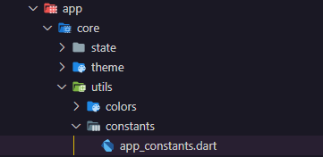
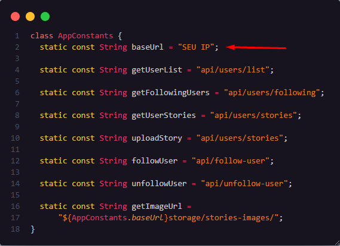

# PRECIFICAR APP

## Configuração Inicial

Certifique-se de ter o Flutter instalado.

1. Instalar dependências
    ```bash
    flutter pub get
    ```

## Adicionar IP

1. Localize o arquivo

  Navegue até a pasta onde o arquivo app_constantes.dart está localizado.

  

2. Edite o arquivo

  Dentro do arquivo, você provavelmente encontrará constantes definindo configurações do aplicativo. 

  Devemos atribuir o IP a constante "baseUrl".

  

