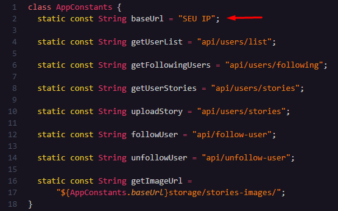

# PRECIFICAR APP

## Configuração Inicial

Certifique-se de ter o Flutter instalado.

1. Instalar dependências
    ```bash
    flutter pub get
    ```

## Adicionar IP

1. Localize o arquivo
   ```bash
    Navegue até a pasta onde o arquivo app_constantes.dart está localizado.
    ```

    

2. Edite o arquivo
    ```bash
    No aquivo app_constantes.dart atualize com seu IP a constante baseUrl.
    ```

    

    ```http
    static const String baseUrl = "http://SEU_ENDERECO_IP:8000";
    ```

3. Build App
     ```bash
    Agora basta abrir o emulador android e apertar F5 para inciar o build.
    ```